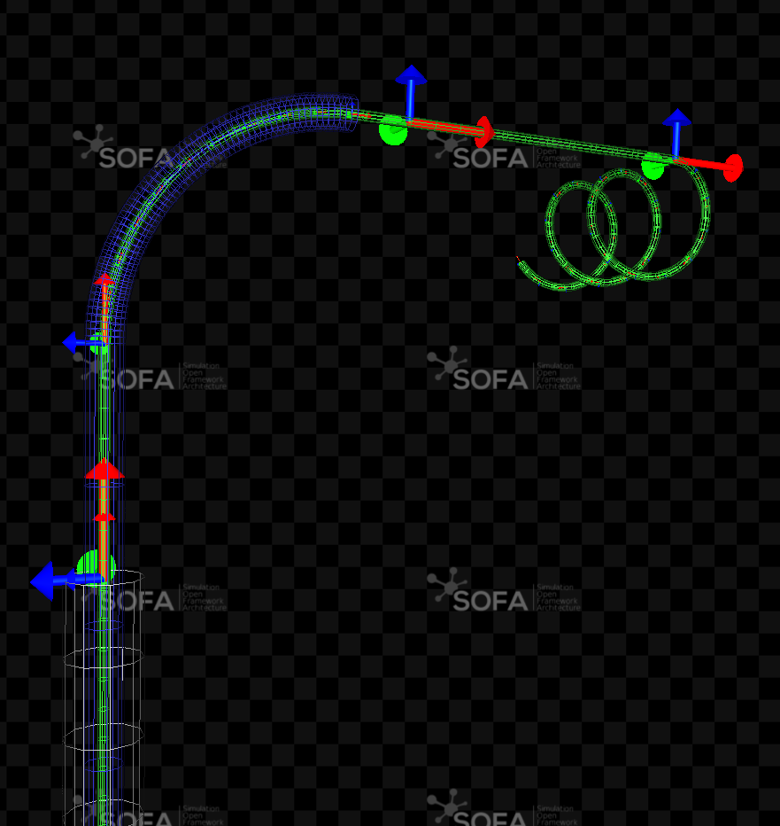

# BeamAdapter plugin

## Description

This SOFA plugin implements a 1-dimensional Finite Element Method (FEM) based on the Kirchhoff rod theory and allows to simulate any 1D flexible structure, like catheters, guidewires or coils in a medical context.

This plugin proposes an adaptive implementation allowing for the interactive deployment of one or several concentric tools. This approach is therefore especially well designed for interventional radiology interventions, more especially the simulation of a catheter deployment. 

## Build instructions

This plugin relies on the open-source project SOFA. To build the sources of this plugin, you can follow the associated "[Build a plugin from sources](https://www.sofa-framework.org/community/doc/plugins/build-a-plugin-from-sources/)" documentation page.

## Documentation

- [API Documentation](https://sofa-framework.github.io/BeamAdapter/)
- [Full readme documentation](./doc)

## Related publications

If you are using this code in your research work, please cite us!

- [A (Near) Real-Time Simulation Method of Aneurysm Coil Embolization](https://hal.inria.fr/hal-00736865/en)
- [Towards interactive planning of coil embolization in brain aneurysms](https://hal.inria.fr/inria-00430867/en)
- [Interactive Training System for Interventional Electrocardiology Procedures](https://hal.inria.fr/hal-01338346/en)

If this work is useful for your industrial application, your [support](https://www.sofa-framework.org/consortium/support-us/) would be most welcome.

