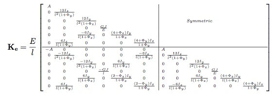
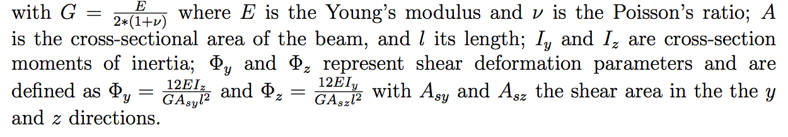
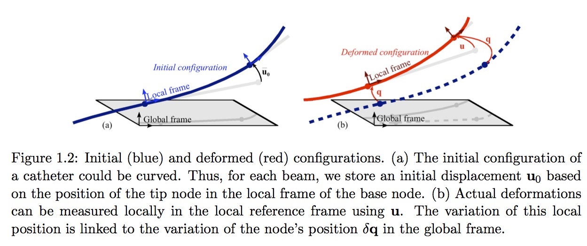

This page presents the mechanical basis of the beam model and how the internal forces are computed.

# Modeling Theory
Beam elements are used to model instruments (or anatomical structures) for which the length is greater than the other transverse dimensions. For the general introduction of beam theory and equations, see p.509 [5] . 

The particular nature of such objects generally leads to large geometric deformations, which is notorious for being computationally demanding. 
Examples of objects with this geometry are abundant in medical simulation.  

The approach that is used in the plugin is initially based on a linear beam analysis. But it extends this representation by a series of optimizations particularly suited for real-time animation. 
By using a Corotational approach, our model can handle the important geometric non-linearity due to large changes in the shape of the object.

 

## 1. Corotational beam model
To model the deformation of any solid body whose geometry and mechanical characteristics are similar to a wire, 
rod or beam, we use a representation based on three-dimensional beam theory *see Przemieniecki (1985) [2]*, where the 
elementary stiffness matrix Ke is a 12 × 12 symmetric matrix that relates angular and spacial positions of each end 
of a beam element to the forces and torques applied to them:

 
            

parameters:

  
     

The assumption of the corotational model is that the deformations remain ”small” at the level of each element. 
Thus, a local frame is defined for each beam. Thus, the force  **fe** at the level of the element is equal to:

**fe = Ke (u - u0)** (1)

where **u** and **u0** reflect respectively the actual and the initial configuration of the beam,
in the local frame of the beam.
Since the stiffness matrix **Ke** is initially calculated in local coordinates, 
it is necessary to introduce transformation matrices changing the reference frame from a local to a global coordinate system. 
In order to determine the stiffness property of the complete structure, 
a common reference frame must be established for all unassembled structural elements so that all the displacements 
and their corresponding forces will be referred to a common (global) coordinate system. 
We need a matrix relationship between the variation of the position δ **u** in the local coordinate system and the variation of the node position 
δ **q** in the global coordinates.

 
                

This relationship is expressed by the matrix equation:

δ **u** = **Λ(q)**     δ **q** (2)

where **Λ(q)** is a matrix obtained from the direction cosines of angles between the local and global coordinate systems.
The linearization of the element force-displacement equation is obtained in global coordinates:

δ **F(q)** = [**ΛT(q)** **Ke** **Λ(q)**] δ **q**   (3)

The model can be combined with the computation of a mass matrix to obtain mechanical dynamic model. 
We then use the equation 3 to compute the system. 
One important feature of this model is that the interpolation is performed segment by segment between only two frames. 
Additionally, these frames are the independent Degrees of Freedom (DoFs) of the system.

 

## 2. B-splines , Bézier Splines

B-splines in general and Bézier splines in particulary can see in *[1]* or more detail in *[3]*. A
spline tool can see at *[4]*. Here assumed several general formula. In general, a Bézier curve order
n is determined by n + 1 control points (characteristic polygone) $P_{i, 0 \le i \le n}$ ,06i6n. Its trajectory is:

$B(t)$=$\sum_{i = 0}^{n} \widehat{B}_{i,n}(t).P_i$

Where $\widehat{B}_{i,n}(t)$ are Bernstein polynomial given by:

$\widehat{B}_{i,n}(t)=\binom{n}{i}.t^{i}.(1-t)^{n-i}$

The most usually used is the cubic Bézier , where trajectory is given by

$(1 − t)^3.P_0 + 3.(1 − t)^2.t.P_1 + 3.t^2.(1 − t).P_3 + t^3.P_3$

 

# Implementation
In the following, we describe the main components of the implementation of BeamAdapter Plugin. 
For a full description of a BeamAdapter scene, check the [implementation documentation](docs/implementation.md) and here is the documentation of the [API C++ code](https://sofa-framework.github.io/BeamAdapter/)

One of the central component of the beams is the shape function. 
The description of the shape function relies on:
- One topology of edges
- A set of frames with Dofs (3 translations, 3 rotations) that corresponds to the points of the topology
- A spline (3d order) support for each edge

## WireRestShape
This component allows to define the rest shape of Wire instrument such as a catheter (modeled with a set of beams), the numerical parameters used in the simulation, and the topology used for the visualisation.

 
                

Several physical and geometry parameters can be defined using SOFA Data such as the **densityOfBeams**, **straightLength**, **youngModulus**, **numEdges**, etc. See [implementation documentation](docs/implementation.md) for the full list.

## WireBeamInterpolation

This component is one of the most important in the modeling of catheter devices: It contains the interpolation functions that are dynamically updated when the catheter is deployed. Inside the component, the geometric support of each beams is a cubic spline. From the two frames at the extremities of the beam, we define the 4 control points of the cubic splines. The construction is made to guaranty a C1 continuity between splines.

## AdaptiveBeamForceFieldAndMass

This component computes the Force and the mass using a beam formulation. The computation is based on a « corotational approach ». 

From the two 6DOF position of the nodes of the beam, we extract 4 points for defining a spline. Using this spline, we can find one central frame for the beam (in red in the figure). There is only one rotation that is not determined (along the axis of the spline). To find this twiting orientation, we use a slerp. The computation of the deformations of the beams are done in this frame and suppose linear deformations using beam elements (Timoshenko beams) .

## AdaptiveBeamMapping

This mapping allows to drive the Mechanical Object of the collision object thanks to the position and velocity of the Mechanical Object of the parent node. In the opposite direction, the Mapping also allows to transfer the forces and the constraints from the collision model to the DOFs (the nodes of the beam). 
The hypothesis of beam FEM is based on interpolation function. This why this MultiAdpativeBeamMapping will rely on the interpolation defined in the WireBeamInterpolations. However, for the specific case of catheter instruments, several concentric instruments can be inserted. Then the mapping has to be done with the good interpolation functions

 
                

 

# References
1. F. Andersson, *Bézier and B-spline Technology*, PhD thesis, Juin 2003
2. J. Przemieniecki. *Theory of matrix structural analysis. McGraw-Hill*, 1985.
4. T. W. Sederberg, *Computer Aided Geometric Design*, 2011 ed.
5. T-Spline, http://www.tsplines.com/
6. T.Belytschko, W. K. Liu, and B. Moran, *Nonlinear Finite Elements for continua and structures*, 2000.
