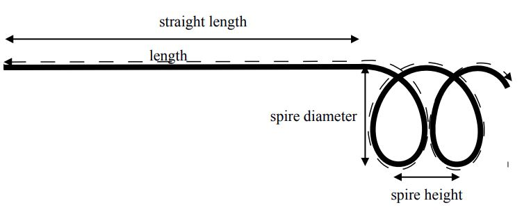
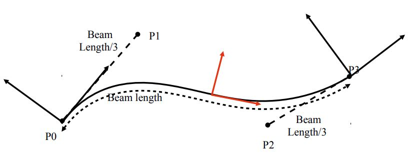
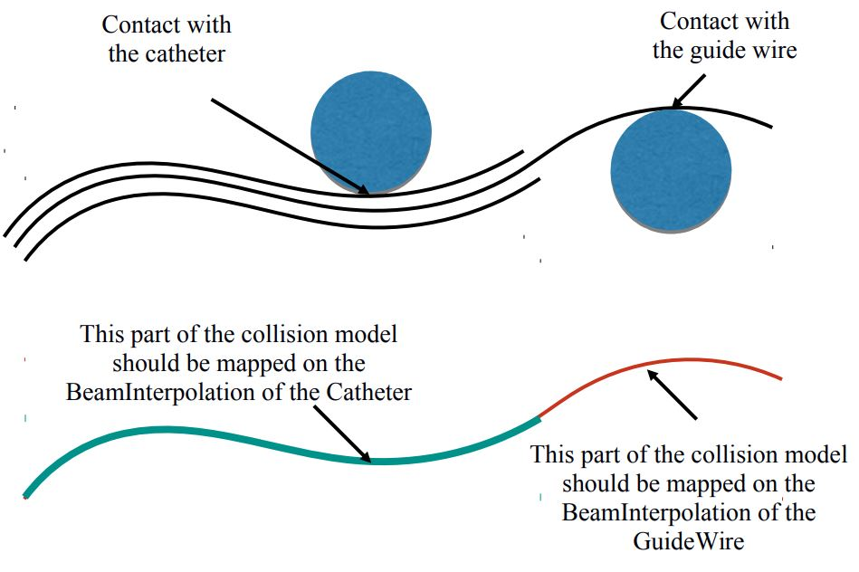

# Scene Implementation 

In this document we will list and describe the main components used in the scene [3instruments_collis.scn](https://github.com/epernod/BeamAdapter/blob/master/examples/3instruments_collis.scn) aiming at modeling the deployment of 3 instruments. The catheter is modeled by beam elements using the FEM. The vascular network is represented by a triangulation surface.

Control of the scene :
- CTRL+ UP (arrow): forward
- CTRL+ DOWN (arrow): backward

# All BeamAdapter components

## 1. The Components on Root Node

### RequiredPlugin
This component allows to dynamically load the needed plugin(s) before starting to create the scene. Many components will be taken from the plugin « BeamAdapter ». One « RequiredPlugin » is needed for each loaded plugin.

-   pluginName : define the name of the needed plugin

### VisualStyle
This component allows to show or hide the visualization of different kind of components such as \"Visual\", \"Behavior\", \"Mapping\", « Collision »...

-   displayFlags : « showVisualModel » will make all visual model visible, « hideVisualModel » will do the opposite.

### FreeMotionAnimationLoop
« FreeMotionAnimationLoop » allows to define this new scheduling and launch the main steps of the simulation.

To solve contacts with Lagrange multipliers, the strategy is to perform first a « free motion » (without any constraint), then compute the collision, solve the contacts, and do a « corrective motion ». As the main scheduling of the simulation is modified, we need to define a new AnimationLoop.

See \[1\] and \[2\] for more theoretical aspects.

### LCPConstraintSolver
Some To solve the Lagrange multipliers defined at each contact point, we use a global solver. This solver will solve the complementarity problem that is created by contact and friction constraints.

-   tolerance : Defines the residual error threshold for termination ofthe Gauss-Seidel algorithm maxIt : Defines the maximal number of iterations of the Gauss-Seidel algorithm
-   mu: friction coefficient
-   build_lcp : Allows for an optimisation of the computation of the Gauss-Seidel algorithm.

This optimisation allows not to build the full matrix of the compliance matrix in the constraint space. It works with BTDLinearSolver and LinearSolverConstraintCorrection (see below).

This implementation is an improved version of the algorithm published in \[3\] (and also explained in \[2\]). The algorithm relies on the Block Tri-Diagonal structure of the matrix. When we have this type of matrix, we could compute the Gauss-Seidel iterations without building the matrix W (see notations used in \[2\] or \[3\]). It reduces a lot the complexity !

### CollisionPipeline
depth : maximal depth of bounding trees

-   verbose : if true, it displays extra information at each computation step
-   draw : if true, it should draw the detected collisions (but by default, set to false)

### BruteForceDetection
-   name : Gives a name to the component so that it can be referred by another component

### LocalMinDistance
-   name : Gives a name to the component so that it can be referred by another component
-   alarmDistance : distance until which a contact between two objects is detected
-   contactDistance : minimum distance acceptable below which the contact is created and the objects can\'t be closer at the contact location

### CollisionResponse
-   name : Gives a name to the component so that it can be referred by another component
-   response : chooses whether the contact response is a Friction Contact, a StickContactConstraint, a DistanceLMConstraint, a ray, a
    stick, disabled or by default it will be penalty method

Here in the case of the simulation of catheter navigation, we use a Friction Contact formulation which creates 3 constraints (Lagrange Multipliers) per contact (one unilateral in the normal direction of contact and 2 friction constraint in the tangential directions).

### CollisionGroup
This component groups the colliding object inside a same group.
In the case of use of « FrictionContact » with LagrangeMultipliers, the use of CollisonGroup is not necessary.

 

## 2. The Components for the shape of the catheter

This components are placed under the node named « topoLines_cath » and allow to define the rest shape of the catheter , the numerical parameters used in the simulation, and the topology used for the visualisation of the catheter.

### SteerableCatheter

This component is one of the main important to simulate interventional radiology instruments. It inherits from the class adapt the parameters of the simulation.

 
              

-   angleMax: gives the maximum angle of bending of the catheter
-   bendingRate : velocity of the bending
-   densityOfBeams : number of beam when the catheter is fully deployed
-   keyPoints : points on the catheter (defined by curvilinear absissa) where a frame needs always to be placed
-   length : total length of the catheter
-   numEdges : number of edges for the visual model (each edge will be transformed into a series of quad thanks to the Edge2QuadTopologicalMapping
-   numEdgesCollis : number of edges for the collision Model
-   spireDiameter : diameter of the spire (see figure)
-   spireHeight : heigh of each spire. If height = 0 the catheter end shape (for abs.curv \> straight legth) has the shape of a - truncated - circle
-   straightLength : part of the catheter which is perfectly straight (if straightLength = length) the instrument is totally straight.
-   youngModulus : youngModulus of the Straight part
-   youngModulusExtremity : young Modulus fo the spiral at the end of the catheter.

### EdgeSetTopologyContainer
Container for the topology of Edge (important for the visualisation). The number of edges is defined in the component SteerableCatheter (numEdges)

### EdgeSetTopologyModifier, EdgeSetGeometryAlgorithms
These components allow some modification on the topology. Useful for Edge2QuadTopologicalMapping (used in the node « VisuCatheter »)

### MechanicalObject
The mapping Edge2QuadTopologicalMapping needs a Mechanical object templated on rigid, in the same context than the EdgeSetTopologyContainer. **This Mechanical Object is not considered in the simulation (it is not placed under an ODESovler)**

 

## 3. The Components for simulation of the catheter

See Node name : \"InstrumentCombined\"

### EulerImplicit
Integration of the dynamics is made through a backward (implicit) Euler scheme.
The scheme is  « naturally » damped, in particular if dt is large, but additional damping can be set:
-   rayleighMass : Damping coefficient proportional to the mass
-   rayleighStiffness : Damping coefficient proportional to the stiffness

The component EulerImplicit will create a linear matrix problem (equivalent to one step of a Newton Raphson Algorithm), that needs to be solved by a Linear Solver (see below)

### BTDLinearSolver
Block Tri Diagonal Linear solver. This solver is specific for the type of matrices we obtain with serially linked beams. Indeed the structure of the matrix is block 6x6 Tri Diagonal. Consequently the solving process could be done with **a linear complexity** !

Moreover, a specific implementation of the BTDLinearSolver allows to not build the full constraint matrix...(see LCPConstraintSolver above). It is very usefull when there is a lot of contact. The complexity is O(m+n) per iteration of the Gauss-Seidel (m :number of beam, n: number of contact) instead of $O(n^2)$.
*Implementation: see in the code, function partial_solve that can be called by the constraint solver through function
addConstraintDisplacement on LinearSovlerConstraintCorrection*

### RegularGrid
Creation of the topology of the beams.
The idea is to initiate the scene with a lot of beam in the topology so that there is no addition / removal during the simulation. Instead all the nodes that are not usefull for the simulation are put in the FixedConstraint by the **InterventionalRadiologyController**.

It allows to have a problem that has always the same size so to avoid big variation of computation performances.
-   nx : number of points
-   ny=nz=1  : the topology is a series of lines.

### MechanicalObject
This mechanical object will store the degrees of freedom of the
mechanical model of the catheter.
template=« Rigid » : each node has 6 degrees of freedom: 3 translations
3 rotations (or a quaternion for orientation)

### WireBeamInterpolation
This component is one of the most important in the modeling of catheter devices:
**It contains the interpolation functions that are dynamically updated when the catheter is deployed.** Some components, like
« AdaptiveBeamForceFieldAndMass » or « AdptiveBeamMapping » are directly linked to this interpolation.
*Implementation: The component inherits from BeamInterpolation and provides a specific implementation dedicated to instruments created with WireRestShape, but most of the important functions are in BeamInterpolation*

Inside the component, the geometric support of each beams is a cubic spline. From the two frames at the extremities of the beam, we define the 4 control points of the cubic splines. The construction is made to guaranty a C1 continuity between splines.
-   WireRestShape : Link to the definition of the instrument rest shape and parameters\
    (see above)
-   radius : radius of the instrument
-   edgeList : number of beam elements

### AdaptiveBeamForceFieldAndMass
This component computes the Force and the mass using a beam formulation. The computation is based on a « corotational approach ».

              

From the two 6DOF position of the nodes of the beam, we extract 4 points for defining a spline. Using this spline, we can find one central frame for the beam (in red in the figure). There is only one rotation that is not determined (along the axis of the spline). To find this twiting orientation, we use a slerp.

The computation of the deformations of the beams are done in this frame and suppose linear deformations using beam elements (Timoshenko beams) .
The mass is also computed based on the parameters of the beam and the volume mass of the material that is used for the wire.
-   interpolation : link to the wireBeamInterpolation (or BeamInterpolation) that provides the interpolation of the beams.
-   massDensity : mass density of the material used to build the catheter

### InterventionalRadiologyController

**This controller is also a very important component in the simulation of catheter.**
It controls the insertion / retraction of the catheter and its motion at the base & interactively resamples the instruments with adaptive beams.
-   startingPos : position + quaternion, allows to define the base position of the catheter (the catheter will be deployed from this position)
-   speed : if not 0 the catheter will be inserted at constant speed
-   step : if not constant speed, step is the insertion displacement obtained on the instrument when press ctrl + key ↑ or ↓ .
-   rotationInstrument : same as step but in rotation. A twisting of the instrument could be obtained when press ctrl + key → or ←
-   xtip : curv absissa of the current tip position of the instrument. In practice it corresponds to the length of the instrument that it
    currently simulated. As the instrument is progressively deployed through the startingPoint, xtip is automatically updated when moving the instrument (see speed or step above).

*Note that xtip should be initiated with a small value to begin the simulation with a small part of the instrument simulated.*
-   instruments : list of instruments (i.e. the wirebeaminterpolation of each instrument)
-   controlledInstrument : 0 ; If several instruments are available (not the case in this scene) they can be selected by ctrl + 0 (for
    instrument O), ctrl+1 (for instrument 1)...

### LinearSolverConstraintCorrection
The components ConstraintCorrection are connected to the LCPConstraintSolver (see above). They have two main functions:
-   Add their contribution to the compliance matrix of the constraint system defined by the Lagrange Multipliers associated with the
    constraint
-   Apply the constraint correction, i.e the motion of the object due to the force exerted by Lagrange multipliers.

In the case of the LinearSolverConstraintCorrection, the computation of these two functions is performed by the LinearSolver that is linked to the component. By default, it will link with the linear solver in the same context (here the BTD Linear Solver).

A specific implementation is available when combining LinearSolverCosntraintCorrection and BTDLinearSolver. **This implementation avoids building the full compliance matrix and reduce the computation time of each iteration of the Gauss-Seidel algorithm**, by reducing the complexity from O(n\^2) to O(n+m), (m :number of beam, n: number of contact).

To effectively reduce this complexity, it is important that the constraints (contact, friction, or other... ) are sorted along the
curvilinear in the Gauss-Seidel algorithm. When the option « wire_optimisation » is activated, the component reorder the
constraints that apply to the model.

wire_optimisation: allows constraints to be reordered along a wire-like topology (from tip to base) in order to allow for build_lcp='false\' in the LCPConstraintSolver.

### FixedConstraint
FixedConstraint allows to fix the points that are store in « indices ». InterventionalRadiologyController can change this list of indices.

 

## 4. Collision

The collision model is provided by a set of serially linked edges. The collision model is mapped on the Degrees Of Freedom (here the frames) of the beams

### EdgeSetTopologyContainer, EdgeSetTopologyModifier
Allows to store and change the topology of the collision model.

### MechanicalObject
Template Vec3, this component stores the state of the collision model. Concretely, it provides the positions, the velocities and also the constraints and the forces applied on the points of the collision model.
**This MechanicalObject is a slave state**, i.e, the position & velocity is driven by the MechanicalObject in the parent node, through the mapping (here « MultiAdaptiveBeamMapping »)

### MultiAdaptiveBeamMapping
This mapping allows to drive the Mechanical Object of the collision object thanks to the position and velocity of the Mechanical Object of the parent node.

In the opposite direction, the Mapping also allows to transfer the forces and the constraints from the collision model to the DOFs (the nodes of the beam).

The hypothesis of beam FEM is based on interpolation function. This why this MultiAdpativeBeamMapping will rely on the interpolation defined in the WireBeamInterpolations. However, for the specific case of catheter instruments, several concentric instruments can be inserted. Then the mapping has to be done with the good interpolation functions

 
                  

Consequently the MultiAdaptiveBeamMapping is directly « controlled » by the InterventionalRadiologyController and has to be linked to this component
-   ircontroller : \"../m_ircontroller\" link to the controller
-   useCurvAbs : « 1 » means that the mapping is using the curvilinear abscissa to map the input points...

### Point / Line
Collision primitives of the model

 

## 5. Visualization

Each instrument could have its own visual model even if they are all sharing the same DOFs.
Thanks to the WireBeamInterpolation component, every instrument has its own interpolation functions defined on these shared DOFs.

### Topology Components: QuadSetTopologyContainer, QuadSetTopologyModifier, etc...
This components allow for doing the Edge2QuadTopologicalMapping which consist in automatically constructing a cylinder mesh composed of quad elements when a set of edges are defined.
-   nbPointsOnEachCircle : on each cross section, defined the number of
    point
-   radius : radius of the cylinder
-   input : edgeSetContainer that defines the input set of lines

### MechanicalObject
Store the state of the visual model. Here only position and velocity are important . This state is slave of the mechanical Object defined on the parent node (the degrees of freedom of the beams).

### AdaptiveBeamMapping
AdaptiveBeamMapping maps the position of the MechanicalObject (defined above) with the position of the parent nodes.
-   interpolation: link to the interpolation functions that define the position of each point of the instrument
-   isMechanical= false : no need to map any mechanical component: the forces, the mass etc.
-   input: mechanical Object that contains the frames of the beams (here « @DOFs »)
-   output: mechanical Object that is being mapped (here« @QuadsCatheter »)

### OglModel
Open GL state of the model =\> SOFA allows to display openGL objects. These objects are often defined by a set of triangles or quads and the position of the points of the mesh.

If using an other viewer than the one use in SOFA, you can change this component

### IdentityMapping
Here, the identitymapping will allow to copy the position of the MechanicalObject (mapped under the AdaptiveBeamMapping) on the OglModel to display it.

 

# References

\[1\] Faure, F., Duriez, C., Delingette, H., Allard, J., Gilles, B., Marchesseau, S., \... & Cotin, S. (2012). Sofa: A multi-model framework
for interactive physical simulation. In *Soft tissue biomechanical modeling for computer assisted surgery* (pp. 283-321). Springer, Berlin, Heidelberg.

\[2\] Duriez, C. (2013). Real-time haptic simulation of medical procedures involving deformations and device-tissue interactions
(Habilitation Thesis, Université des Sciences et Technologie de Lille-Lille I).

\[3\] Duriez, C., Cotin, S., Lenoir, J., & Neumann, P. (2006). New approaches to catheter navigation for interventional radiology
simulation. *Computer aided surgery*, *11*(6), 300-308.
